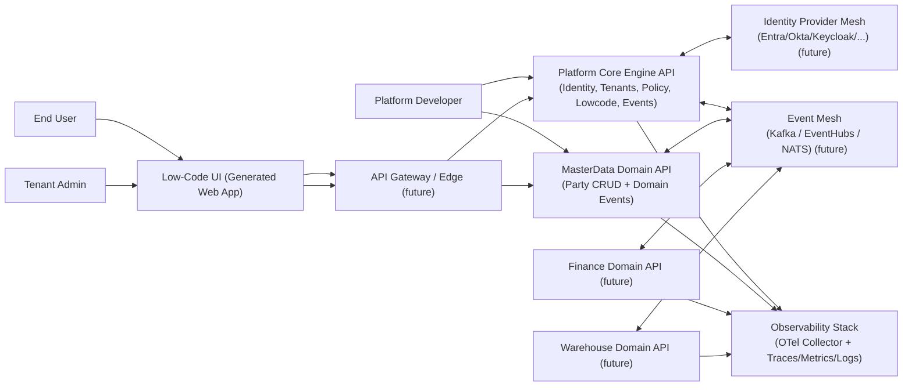
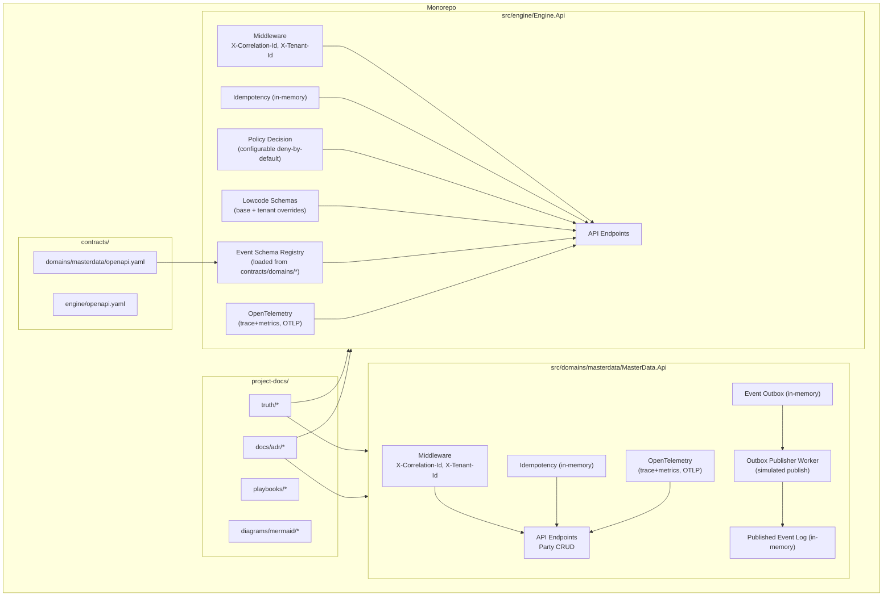
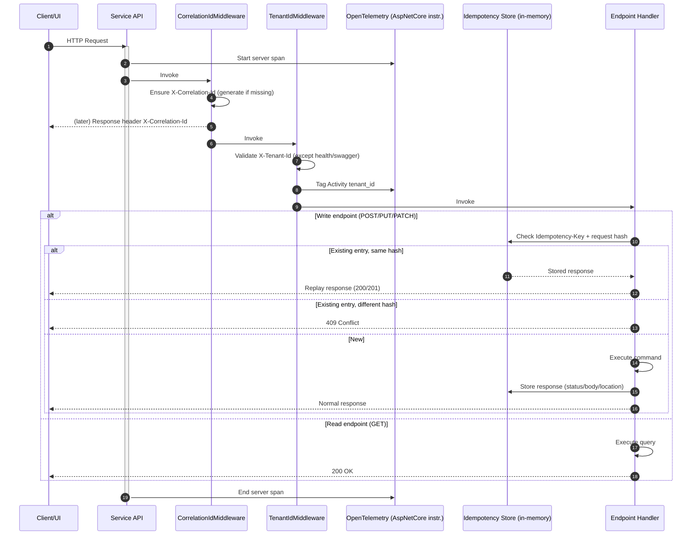
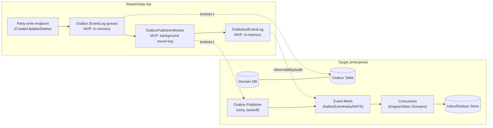
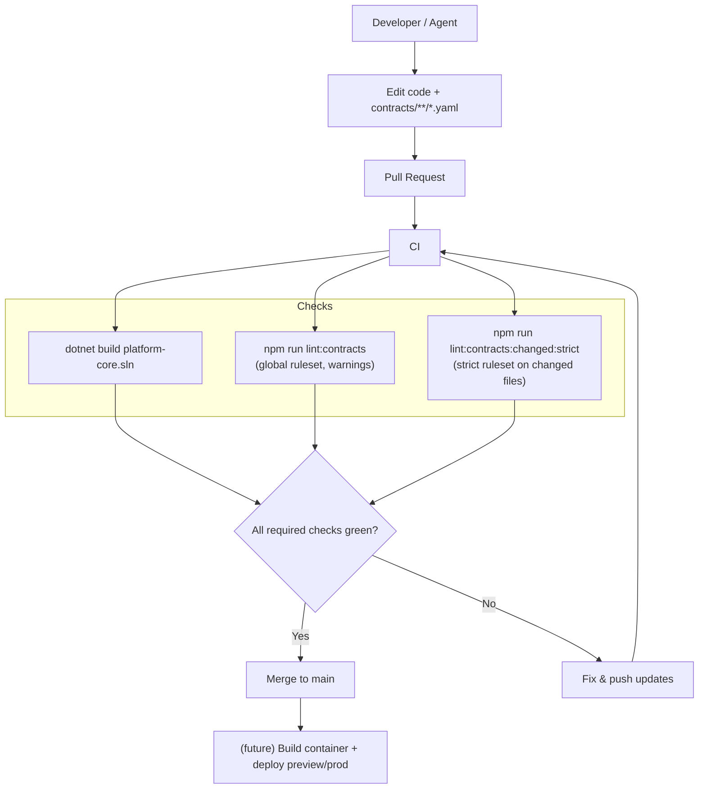

# Mermaid diagrams

This folder contains Mermaid source files describing the target architecture and key flows.

Files:
- `01-system-context.mmd` - system context diagram
- `02-container-modules.mmd` - container/module view (monorepo)
- `03-request-dataflow.mmd` - request processing flow (headers, idempotency, traces)
- `04-event-outbox-flow.mmd` - outbox/event flow (MVP -> target evolution)
- `05-contract-governance-flow.mmd` - contracts + CI governance flow

---

## 01 – System context

Source: `01-system-context.mmd`

---

## 02 – Container / modules

Source: `02-container-modules.mmd`

---

## 03 – Request dataflow

Source: `03-request-dataflow.mmd`

---

## 04 – Event / outbox flow

Source: `04-event-outbox-flow.mmd`

---

## 05 – Contract governance flow

Source: `05-contract-governance-flow.mmd`

